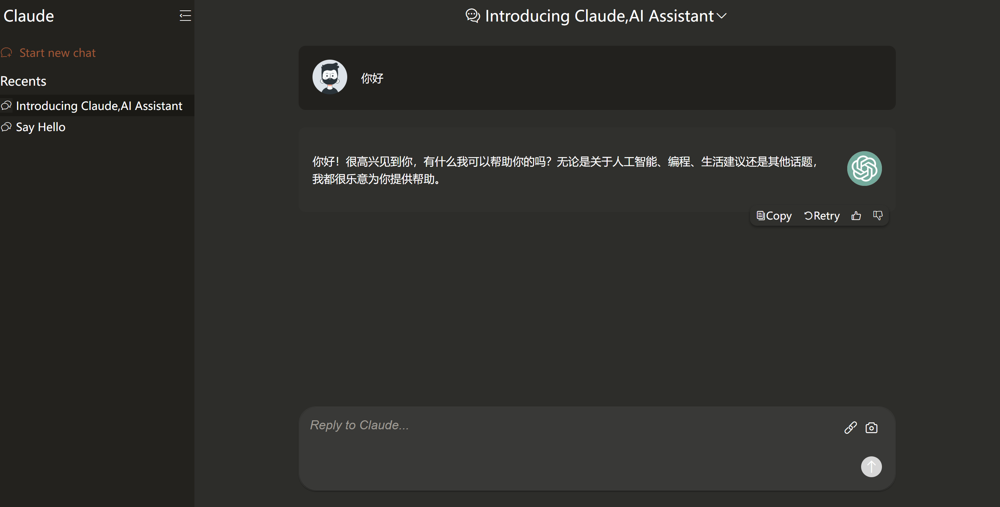

# LLM 组件

本项目实现了一个基于 **Quill 编辑器** 的 LLM 组件，支持插入图片、PDF 和发送消息功能。该组件使用 **Vue 3** 和 **VueUp Quill** 库进行开发。
运用到的大模型接口是：https://cloud.siliconflow.cn/i/A9DheOWR

## 特性

- 支持富文本编辑，包括文字格式化、插入图片和 PDF。
- 可以与后端进行交互，发送消息并获取响应。
- 内置插入图片和 PDF 功能，用户可直接在编辑器中添加内容。
- 支持自定义按钮和图标，增强交互体验。

## 项目结构

- **RichTextEditor.vue**：富文本编辑器组件，包含 Quill 编辑器和自定义功能（如插入图片、PDF 等）。
- **@vueup/vue-quill**：集成 Quill 编辑器的 Vue 3 插件。
- **@/api/chat**：用于发送和接收消息的 API 接口。

## 组件使用

### 安装依赖

在使用该组件之前，确保你已经安装了 **Vue 3** 和相关依赖。

## 效果图

